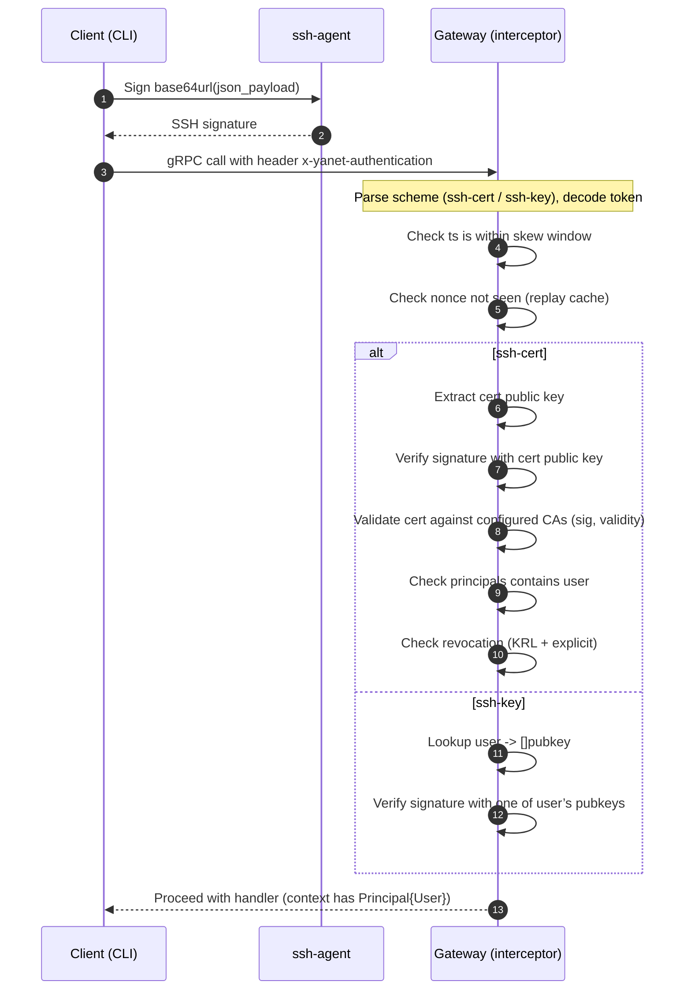
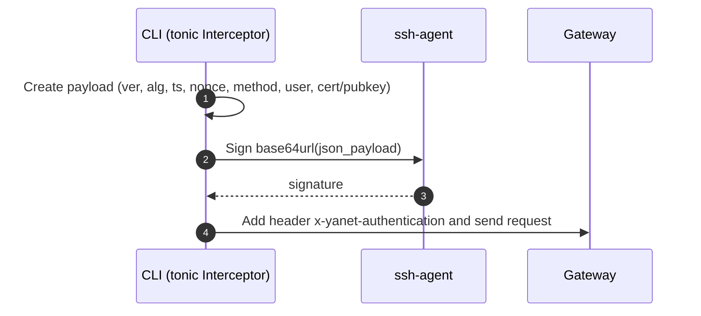

# Authentication for Gateway API

## Goals

- Authenticate the caller of every gRPC call to the Gateway.
- Use per-call authentication via a single metadata header.
- Support mechanisms: SSH public key, SSH certificate with CAs and KRL. If no mechanism is configured, authentication is effectively disabled.
- Keep backends untrusted: authentication is enforced at the Gateway; metadata may be forwarded but is not relied upon by backends.

## High-level design

- A single gRPC metadata header `x-yanet-authentication` carries a compact self-contained token.
- Server attaches unary and stream interceptors to validate the token on every call (including proxied calls).
- On success, server places `Principal{User string}` into the request `context` and logs auth fields.

## Mechanisms

- ssh-key: server stores an in-memory mapping `user -> []authorized_keys` and verifies signatures with a user’s allowed key(s).
- ssh-cert: client includes an OpenSSH user certificate; server validates it against configured CAs and checks revocation via KRL (and optional explicit lists). Principal is taken from the certificate’s principals.

## Header and token format

- gRPC metadata header:
  - `x-yanet-authentication: ssh-cert <token>`
  - `x-yanet-authentication: ssh-key <token>`

- Token encoding:
  - `<b64url(json_payload)>.<b64url(signature)>`

- JSON payload (common fields):
  - `ver`: integer, token version (e.g., 1)
  - `alg`: SSH signature algorithm (e.g., "ssh-ed25519", "rsa-sha2-512")
  - `ts`: Unix seconds (int)
  - `nonce`: base64url of 16–32 random bytes
  - `method`: full gRPC method (e.g., "/ynpb.PdumpService/ShowConfig")
  - `user`: principal (string)

- ssh-cert specific fields:
  - `cert`: OpenSSH user certificate, as an authorized_keys-style public cert line, e.g. `ssh-ed25519-cert-v01@openssh.com AAAA... comment` (the comment is optional)
  - `key_id`: certificate key id (duplicate of the field inside the cert; included for convenient logging and policy)

- ssh-key specific fields:
  - `pubkey`: authorized_keys-style public key line, e.g. `ssh-ed25519 AAAA... comment`
  - `key_id`: optional logical identifier for logging/policy

- Signature input:
  - The SSH agent signs the literal ASCII bytes of the first token segment: `<b64url(json_payload)>` (without the trailing dot).
  - Verification uses exactly the received first segment bytes; no JSON re-serialization or canonicalization is performed.
- Notes:
  - `payload.method` must match the actual gRPC method name from the server context.
  - `payload.nonce` is the same base64url string contained in `nonce`; it is not decoded during signing.

### Server-side verification flow

Sequence:



Validation details:

- Time skew: reject if `abs(now - ts) > clock_skew` (default 60s).
- Nonce replay protection: in-memory cache of used nonces with TTL (default 5m). Reject if seen.
- Method binding: `payload.method` must equal the actual gRPC method name.
- ssh-cert mode:
  - Verify signature using the certificate’s embedded public key.
  - Validate the certificate against configured CAs (OpenSSH user CA public keys): signature, `valid_after/valid_before`, and usage.
  - Ensure `user` is one of the certificate principals (or otherwise policy-accepted).
  - Revocation: check OpenSSH KRLs and optional explicit revocation lists.
- ssh-key mode:
  - Select verification key from `AuthorizedKeys[user]` (no iteration over unrelated users).
  - Verify signature; optional key constraints may be supported later.

On success:

- Add `Principal{User}` to `context`.
- Add auth fields to logs for observability: `user`, `scheme`, `key_id`, `cert_serial`, `ca_fingerprint` (when applicable).

On failure:

- Return `Unauthenticated` with a concise reason. Do not leak sensitive detail.

### Interceptor integration

- Attach both interceptors when creating the server:
  - `grpc.ChainUnaryInterceptor(authUnary)`
  - `grpc.ChainStreamInterceptor(authStream)`
- This applies to all registered services and the proxy `TransparentHandler`.

### Configuration (proposed)

YAML snippet (subject to minor naming adjustments during implementation):

```yaml
server:
  endpoint: "[::1]:8080"
  http_endpoint: ""
  auth:
    ssh:
      # Choose exactly one of the blocks below.
      # 1) ssh-key mode
      authorized_keys:
        esafronov:
          - "ssh-ed25519 AAAAC3NzaC1lZDI1NTE5AAAAI... esafronov@host"
          - "ecdsa-sha2-nistp256 AAAAE2..."
      # 2) ssh-cert mode
      ca:
        - "/etc/yanet/trusted-user-ca-ecdsa.pub"
        - "/etc/yanet/trusted-user-ca-ed25519.pub"
      # Revocation (RKL/KRL)
      krl:
        - "/etc/yanet/user-keys.krl"
      revocations:
        by_serial:
          # keyed by CA fingerprint (OpenSSH format, e.g., SHA256:...)
          "SHA256:xxxxxxxxxxxxxxxxxxxxxxxxxxxxxxxxxxxxxxxxxxx":
            - { start: 1000, end: 1500 }
            - { start: 2001, end: 2001 }
        by_key_id:
          "SHA256:xxxxxxxxxxxxxxxxxxxxxxxxxxxxxxxxxxxxxxxxxxx":
            - "stolen-laptop"
            - "retired-key-2025-08"
      # Anti-replay & time settings
      clock_skew: 60s   # allowed ts skew
      nonce_ttl: 5m     # time to remember nonces
```

Notes:

- Server loads all configured providers. The requested provider is selected per-call by the header scheme (e.g., `ssh-cert`, `ssh-key`).
- If `ca` is present, ssh-cert is available; if `authorized_keys` is present, ssh-key is available. Both can co-exist.

### CLI (ssh-agent) integration

- Clients (e.g., module CLIs built with tonic) add a per-call interceptor that:
  - Determines the full gRPC method name.
  - Generates `ts` and random `nonce`.
  - Builds the JSON payload and encodes it with base64url (no padding).
  - Asks `ssh-agent` to sign the first segment bytes; appends base64url(signature) as the second segment.
  - For ssh-cert mode, adds the corresponding OpenSSH user certificate to the payload (from agent or a file); for ssh-key mode, adds the public key.
  - Sets the `x-yanet-authentication` metadata header.

Client-side sequence:



### Revocation (KRL/RKL)

- KRL files are loaded at startup and can be reloaded periodically or on signal (implementation detail). Multiple KRLs are supported.
- Explicit revocations (by CA fingerprint and serial ranges or key IDs) overlay on top of KRL decisions.
- A certificate is rejected if any revocation source marks it as revoked.

### Alternatives

- SSH per-connection (TLS client cert via SSH tunneling)
  - Pros: no per-call overhead; mature tooling.
  - Cons: identity bound to channel, hard with proxies/load balancers; poor user attribution per-call.

- mTLS (X.509 client certs)
  - Pros: strong mutual auth; widespread support; hardware-backed keys.
  - Cons: channel-bound identity; cert provisioning/rotation complexity; breaks transparent proxying.

- OIDC/JWT bearer tokens
  - Pros: widely adopted; stateless verification; supports delegation and expiration.
  - Cons: requires token issuer/OP; clock sync; token leakage risk; agentless signing may store keys on disk.

- HMAC API keys (signed requests)
  - Pros: simple, fast, no public-key infra.
  - Cons: server must store shared secrets; rotation and leakage are risky; weaker non-repudiation.

- Plain SSH public keys (no certs)
  - Pros: minimal infra; easy to bootstrap.
  - Cons: no embedded principal/expiry; revocation is manual; scales poorly across users/devices.

- SPIFFE/SPIRE (SVID, mTLS)
  - Pros: workload identity, auto-rotation, strong zero-trust.
  - Cons: heavyweight control-plane; cluster-focused; raises operational bar.

- Macaroons
  - Pros: attenuation via caveats; fine-grained delegation.
  - Cons: niche ecosystem; more complex client/server libraries.

- Basic/API keys (static)
  - Pros: trivial to implement.
  - Cons: insecure by default; no signing, replay protection, or attribution.

### Security considerations

- Bind signatures to `method`, `user`, `ts`, `nonce` to prevent replay and re-targeting.
- Strict time skew and nonce TTL provide replay protection without shared storage.
- All methods require authentication by default. Exemptions must be explicit and minimal.
- Do not forward or rely on the token in backends for security decisions; Gateway enforces auth.
